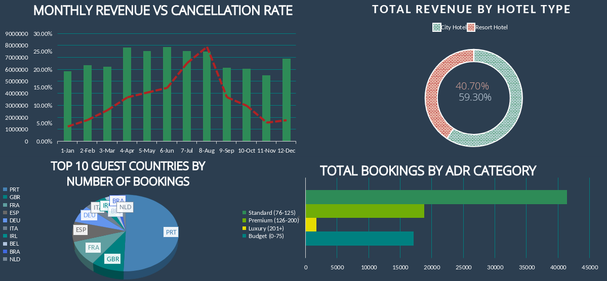
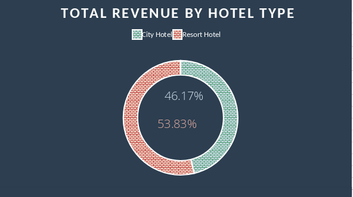
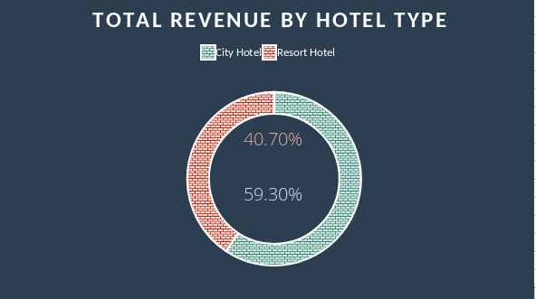
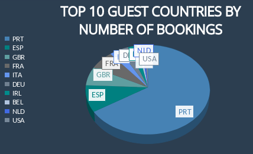
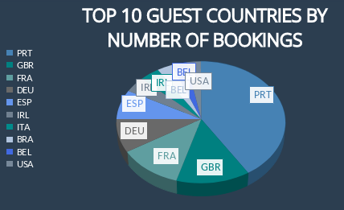
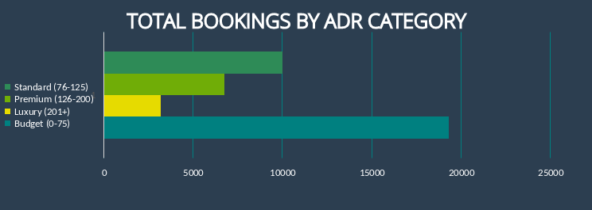
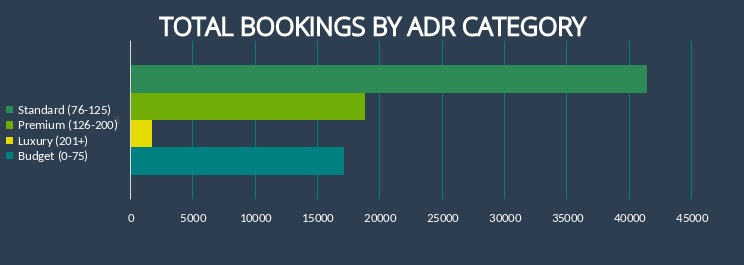
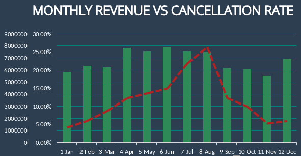

<h1 align="center"><b>Analiza Wyników Hotelu: Dogłębne Spojrzenie na Zachowania Gości</b></h1>

Ten projekt przedstawia kompleksową analizę danych dotyczących rezerwacji hotelowych, skupiając się na segmentacji gości, rentowności kanałów dystrybucji oraz czynnikach ryzyka, w celu wsparcia procesów decyzyjnych na szczeblu zarządczym. Analiza została przeprowadzona z wykorzystaniem potoku danych w języku Python, a finalne wizualizacje zbudowano w programie MS Excel oraz na platformie Apache Superset.

---

## Interaktywny Dashboard (Apache Superset)

Stworzony w Apache Superset dashboard na żywo pozwala na monitorowanie kluczowych wskaźników wydajności (KPI). Umożliwia on dynamiczne filtrowanie danych według typu hotelu, roku oraz segmentu klienta.

    

---

## Kluczowe Wnioski i Rekomendacje Strategiczne

### Analiza z Głównego Dashboardu

**1. Wniosek: Segmenty Rynku Ukazują Wyraźny Profil "Ryzyka vs. Zysku"**
*   Wykres bąbelkowy `Channel Analysis` pokazuje, że kanał **Online TA** (internetowi agenci turystyczni) jest zdecydowanie największym źródłem przychodów. Segment ten reprezentuje nasz "przeciętny" profil klienta i charakteryzuje się wysokim wskaźnikiem anulacji.
*   W przeciwieństwie do tego, segment **Groups** (rezerwacje grupowe), mimo generowania wysokiego potencjalnego przychodu, jest wyjątkowo zawodny z powodu dość wysokiego wskaźnika anulacji.
*   **Rekomendacja 1 (Grupy):** Wprowadzenie obowiązkowej, bezzwrotnej zaliczki dla wszystkich rezerwacji grupowych w celu zabezpieczenia się przed ich dużą zmiennością.
*   **Rekomendacja 2 (Online TA):** Dla "przeciętnego" klienta rezerwującego przez kanały Online TA, wprowadzenie opcjonalnych dodatków "elastyczna anulacja" za niewielką opłatą. Stworzy to nowe źródło przychodów, dając jednocześnie większości klientów jasny wybór między niższą ceną a elastycznością.

**2. Wniosek: Segment "Rodziny" napędza lato, podczas gdy "Pary" dominują przez cały rok**
*   Wykres warstwowy `Revenue Mix` wyraźnie pokazuje, że udział segmentu `Family` w przychodach gwałtownie rośnie w miesiącach letnich (czerwiec-sierpień).
*   Analiza z użyciem fragmentatorów ujawniła ponadto, że segment **Couple** stanowi największą część gości w ujęciu ogólnym, tworząc stabilny trzon działalności hotelu.
*   **Rekomendacja (Strategia podwójna):**
    *   **Specjalizacja w trzonie działalności:** Wzmocnienie oferty dla par przez cały rok (np. pakiety romantyczne, kolacje). Ugruntuje to naszą pozycję na głównym rynku.
    *   **Maksymalizacja szczytu sezonu:** Uruchomienie precyzyjnie ukierunkowanych kampanii marketingowych dla rodzin późną wiosną oraz zaoferowanie udogodnień dla rodzin w lecie, aby w pełni skapitalizować ten kluczowy sezonowy wzrost.

**3. Wniosek: Niewielka Liczba Gości Powracających**
*   Dane pokazują, że wskaźnik powracających gości jest niższy niż pożądany.
*   **Rekomendacja:** Uruchomienie prostego, ale skutecznego programu lojalnościowego. Zniżka "Witaj Ponownie" w wysokości 10-15% na następną rezerwację bezpośrednią byłaby efektywnym kosztowo sposobem na zwiększenie wartości życiowej klienta (CLV) i zapewnienie bardziej wiarygodnych przychodów.

### Wnioski z Analizy w MS Excel

**4. Wniosek: Rodziny Zdecydowanie Preferują Hotel Typu Resort**
<table>
  <tr>
    <td align="center">
      <em>Wykres 1: Dystrybucja Segmentu Rodzin</em>
       
      
    </td>
    <td align="center">
      <em>Wykres 2: Dystrybucja Segmentu Par</em>
       
      
    </td>
  </tr>
</table>

*   Interaktywne filtrowanie ujawniło, że segment klientów **Family** wybiera **Resort Hotel o 7% częściej** niż City Hotel, podczas gdy segment **Couple** wybiera **City Hotel o 19% częściej**. Wskazuje to na wyraźne dopasowanie rynku do produktu.
*   **Rekomendacja (Specjalizacja czy Dywersyfikacja):** Kierownictwo musi podjąć strategiczną decyzję: albo wzmocnić markę Resort Hotel jako docelowe miejsce dla rodzin (specjalizacja), albo zainwestować w udogodnienia dla rodzin w City Hotel, aby przyciągnąć ten cenny segment w środowisku miejskim (dywersyfikacja).

**5. Wniosek: Baza Klientów Staje się Coraz Bardziej Zróżnicowana Międzynarodowo**
<table>
  <tr>
    <td align="center">
      <em>Wykres 1: Dystrybucja Klientów w 2015r.</em>
       
      
    </td>
    <td align="center">
      <em>Wykres 2: Dystrybucja Klientów w 2017r.</em>
       
      
    </td>
  </tr>
</table>

*   Analiza rezerwacji w podziale na lata pokazuje wyraźny trend wzrostu liczby unikalnych krajów, z których pochodzą goście.
*   **Rekomendacja:** Przetłumaczenie kluczowych materiałów marketingowych i stron rezerwacyjnych na języki wschodzących rynków (np. hiszpański, niemiecki), aby dodatkowo przyspieszyć ten międzynarodowy wzrost.

**6. Wniosek: Resort Hotel Przyciąga Gości Bardziej Wrażliwych Cenowo**
<table>
  <tr>
    <td align="center">
      <em>Wykres 1: Dystrybucja wg ADR* w Resort Hotel</em>
       
      
    </td>
    <td align="center">
      <em>Wykres 2: Dystrybucja wg ADR* w City Hotel</em>
       
      
    </td>
  </tr>
</table>

*ADR - Średnia Stawka Dzienna (Average Daily Rate)
*   Filtrowanie według typu hotelu wskazuje, że goście w **Resort Hotel** są bardziej skłonni do rezerwowania pokoi z kategorii `Budget` (budżetowej) w porównaniu do City Hotel.
*   **Rekomendacja:** Istnieje tu możliwość dosprzedaży (upselling). Wdrożenie ukierunkowanych e-maili przed przyjazdem, oferujących płatne podwyższenie standardu pokoju do `Standard` lub `Premium` dla gości, którzy zarezerwowali pokój `Budget`. Może to znacząco zwiększyć średnią stawkę dzienną (ADR).

**7. Wniosek: Sezonowość Przychodów jest Nierozerwalnie Związana z Ryzykiem Anulacji**

    

*   Jak pokazuje wykres `Monthly Revenue vs. Cancellation Rate`, przychody osiągają szczyt w sierpniu, co jest napędzane przez wysoki sezon. Jednak temu okresowi maksymalnych przychodów towarzyszy również najwyższy wskaźnik anulacji. Oznacza to, że nasz najpopularniejszy okres rezerwacyjny jest jednocześnie najbardziej niestabilny.
*   **Rekomendacja:** Wprowadzenie dynamicznej polityki na szczyt sezonu. Dla rezerwacji w lipcu i sierpniu należy zaostrzyć zasady anulowania lub wprowadzić warstwowe, bezzwrotne stawki "early bird", aby zabezpieczyć przychody i ograniczyć ryzyko.

## Podsumowanie (Conclusion)

*   **Kluczowe Odkrycie 1 (Szczyt letni):** Widoczny jest silny szczyt przychodów w miesiącach letnich, z kulminacją w **sierpniu**. Potwierdza to, że okres wakacyjny jest finansowo najbardziej krytycznym czasem w roku dla działalności hotelu.

*   **Kluczowe Odkrycie 2 (Paradoks sierpniowy):** Okres maksymalnych przychodów jest jednocześnie okresem maksymalnego ryzyka. Wykres wyraźnie pokazuje, że **wskaźnik anulacji rośnie równolegle z przychodami**, również osiągając najwyższy punkt w sierpniu. Wskazuje to, że sezon wysokiego popytu jest nasycony mniej wiążącymi rezerwacjami, co stanowi znaczące ryzyko dla prognozowania przychodów i stabilności operacyjnej.

*   **Kluczowe Odkrycie 3 (Anomalia grudniowa):** Ciekawy, drugi szczyt przychodów występuje w grudniu. Biorąc pod uwagę, że dane pochodzą głównie z hoteli zlokalizowanych w **Portugalii**, anomalię tę można przypisać wartościowym, krótkim pobytom w okresie świątecznym i **sylwestrowym**, który jest popularnym czasem podróży.

*   **Rekomendacja:** Wymagana jest wieloaspektowa strategia w celu zarządzania tą sezonową zmiennością.
    1.  **Zabezpieczenie przychodów w szczycie sezonu:** Wdrożenie bardziej rygorystycznej polityki bezzwrotnych zaliczek specjalnie dla rezerwacji przypadających na lipiec i sierpień, aby ograniczyć wysokie ryzyko anulacji.
    2.  **Rozwój "sezonu przejściowego":** Uruchomienie kampanii marketingowych w celu przedłużenia szczytu sezonu na bardziej stabilne miesiące "przejściowe" (kwiecień-czerwiec), gdzie przychody są wysokie, a wskaźniki anulacji bardziej kontrolowane.
<h1 align="center"><b>Hotel Performance Analysis: A Deep Dive into Guest Behavior</b></h1>

This project provides a comprehensive analysis of hotel booking data, focusing on guest segmentation, channel profitability, and risk factors to support executive decision-making. The analysis was conducted using a Python data pipeline, with final visualizations built in MS Excel and Apache Superset.

---

## Interactive Dashboard (Apache Superset)

A live, interactive dashboard was created in Apache Superset to monitor key performance indicators. The dashboard allows for dynamic filtering by hotel type, year, and customer segment.

    

---

## Key Findings & Strategic Recommendations

### Analysis from the Main Dashboard

**1. Insight: Market Segments Reveal a Clear "Risk vs. Reward" Profile**
*   The `Channel Analysis` bubble chart shows that **Online TA** (Travel Agents) is the largest source of revenue by a significant margin. This segment represents our "average" customer profile and has a high cancellation rate.
*   Conversely, the **Groups** segment, while generating high potential revenue, is extremely unreliable due to its high cancellation rate.
*   **Recommendation 1 (Groups):** Implement a mandatory, non-refundable deposit policy for all group bookings to hedge against their volatility.
*   **Recommendation 2 (Online TA):** For the "average" customer booking via Online TAs, introduce optional "flexible cancellation" add-ons for a small fee. This creates a new revenue stream while providing a clear choice between price and flexibility for the majority of our clients.

**2. Insight: The "Family" Segment Drives Summer, while "Couples" Dominate Year-Round**
*   The `Revenue Mix` area chart clearly shows the `Family` segment's share of revenue swelling during the summer months (June-August).
*   The slicer analysis further revealed that the **Couple** segment constitutes the largest portion of guests overall, forming the stable backbone of the business.
*   **Recommendation (Dual Strategy):**
    *   **Specialize in the Core:** Strengthen our offering for couples year-round (e.g., romance packages, fine dining). This solidifies our primary market.
    *   **Maximize the Peak:** Launch highly targeted marketing campaigns for families in late spring and offer family-specific amenities during the summer to capitalize on this crucial seasonal surge.

**3. Insight: Repeated Guests Have Low Volume**
*   The data shows that the rate of returning guests is lower than desired. 
*   **Recommendation:** Launch a simple but effective loyalty program. A "Welcome Back" discount of 10-15% on their next direct booking would be a cost-effective way to increase customer lifetime value and secure more reliable revenue.

### Insights from the Excel-Based Analysis

**4. Insight: Families Strongly Prefer the Resort Hotel**
<table>
  <tr>
    <td align="center">
      <em>Chart 1: Family Segment Distribution</em>
       
      
    </td>
    <td align="center">
      <em>Chart 2: Couple Segment Distribution</em>
       
      
    </td>
  </tr>
</table>

*   Interactive filtering revealed that the **Family** customer segment chooses the **Resort Hotel 7% more often** than the City Hotel while the **Couple** customer segment chooses the **City Hotel 19% more often**. This points to a clear market-product fit.
*   **Recommendation (Specialize or Diversify):** Management must make a strategic decision: either double down and brand the Resort Hotel as the ultimate family destination (specialization) or invest in family-friendly amenities at the City Hotel to capture this valuable segment in an urban environment (diversification).

**5. Insight: The Customer Base is Becoming More Internationally Diverse**
<table>
  <tr>
    <td align="center">
      <em>Chart 1: Customer Distribution in 2015</em>
       
      
    </td>
    <td align="center">
      <em>Chart 2: Customer Distribution in 2017</em>
       
      
    </td>
  </tr>
</table>

*   Analysis of bookings by year shows a clear trend of an increasing number of unique guest countries over time.
*   **Recommendation:** Translate key marketing materials and booking pages into languages of emerging top markets (e.g., Spanish, German) to further accelerate this international growth.

**6. Insight: The Resort Hotel Attracts More Budget-Conscious Guests**
<table>
  <tr>
    <td align="center">
      <em>Chart 1: Distribution by ADR* in the Resort Hotel</em>
       
      
    </td>
    <td align="center">
      <em>Chart 2: Distribution by ADR* in the City Hotel</em>
       
      
    </td>
  </tr>
</table>

*ADR - Average Daily Rate
*   Filtering by hotel type indicates that guests at the **Resort Hotel** are more likely to book `Budget` category rooms compared to the City Hotel.
*   **Recommendation:** There is an opportunity to upsell. Implement targeted pre-arrival emails offering paid upgrades to `Standard` or `Premium` rooms for guests who booked `Budget` rooms at the Resort. This could significantly increase the Average Daily Rate (ADR).

**7. Insight: Revenue Seasonality is Intrinsically Linked with Cancellation Risk**

    

*   As shown in the `Monthly Revenue vs. Cancellation Rate` chart, revenue peaks in August, driven by the high season. However, this period of maximum revenue is immediately followed by the highest cancellation rate. This indicates that our most popular booking period is also our most volatile.
*   **Recommendation:** Implement dynamic policies for the peak season. For bookings in July and August, introduce stricter cancellation policies or tiered "early bird" non-refundable rates to secure revenue and mitigate the high risk of cancellations.

## Conclusion 

*   **Key Finding 1 (The Summer Peak):** A strong revenue peak is visible in the summer months, culminating in **August**. This confirms that the summer holiday period is the most financially critical time of year for the business.

*   **Key Finding 2 (The August Paradox):** The period of maximum revenue is also the period of maximum risk. The chart clearly shows that the **cancellation rate peaks in lockstep with revenue**, also reaching its highest point in August. This indicates that the high-demand season is saturated with less committed bookings, posing a significant risk to revenue forecasting and operational stability.

*   **Key Finding 3 (The December Anomaly):** An interesting, secondary revenue spike occurs in December. Given that the dataset is primarily from hotels located in **Portugal**, this anomaly can be attributed to high-value, short-stay bookings for the **New Year's Eve holiday period**, a popular travel time.

*   **Recommendation:** A multi-faceted strategy is required to manage this seasonal volatility.
    1.  **Secure Peak Season Revenue:** Implement stricter, non-refundable deposit policies specifically for bookings occurring in July and August to mitigate the high cancellation risk.
    2.  **Grow the "Shoulder Season":** Launch marketing campaigns to extend the peak season into the more stable "shoulder" months (April-June), where revenue is strong and cancellation rates are more controlled.
